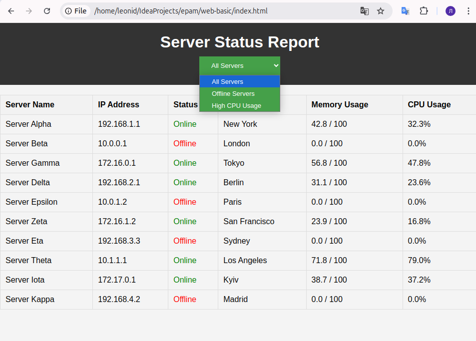

# Functional and Non-functional Requirements for Server Report Design

## Functional Requirements:
- Display a list of servers with their status (Online/Offline).
- Show details like:
    - Server name
    - IP address
    - Uptime
    - Last check time
- Provide filtering options (e.g., show only offline servers).
- Should update automatically every 5 seconds.

## Non-functional Requirements:
- The web page should load quickly.
- It should be responsive (work on desktop and mobile).
- Styling should be clear and professional.
- JavaScript should be used to handle dynamic updates.

